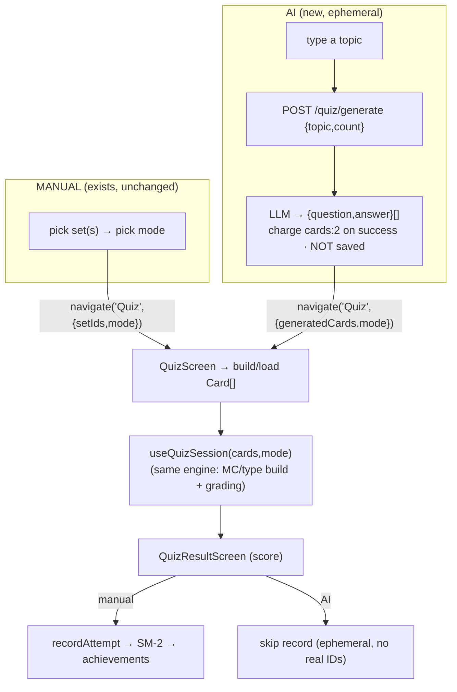

# AI Quiz Generation

> Type a topic → the LLM generates an **ephemeral** quiz you take once. Nothing is
> saved: no cards, no set, no history, no spaced-repetition. It reuses the entire
> existing client-side quiz engine ([[Quiz]]) — the only new thing is *where the
> cards come from* (LLM instead of the DB). Status: **PLANNED** — this note is the spec.

## Decisions (locked)

| # | Decision | Choice |
|---|----------|--------|
| Approach | persist vs ephemeral | **Ephemeral (Option B)** — never create cards/sets, no post-quiz save prompt |
| Entry UX | same vs separate screen | **Same** — QuizSetup gets a topic field alongside "choose sets" |
| Card count | how many | default **8**, floor **4** (so MC works), cap **15** |
| Card type | QA vs STORY | **QA-only** (bulk/parse produces Q+A) → modes = **Multiple Choice + Type Answer** |
| Credits | cost | reuse **`cards:2`**, charge-on-success, refund on failure |
| Distractors | MC options | client builds them from the other generated answers (reuse `useQuizSession`) |

### Accepted ceilings (cost of ephemeral)
- AI quizzes **do not appear in Quiz history** (`QuizHub` recent list).
- **No SM-2** — they never affect Home's "due" count.
- **No achievements** — quiz-taken / perfect / mode counts are unaffected.
- **MC distractors** are other generated answers (may be loosely related). `ponytail:` acceptable v1; LLM-authored distractors later if quality complaints.

> Invariant preserved: [[Quiz]] states quizzes are "free, client-generated, no AI during play." This feature keeps *play* exactly that. It only adds a **credit-metered generation step** (identical in spirit to AI-chat card generation) that produces a normal free-to-play quiz.

## The two paths converge



Only fork: **card source** (DB vs LLM) and **whether the result is recorded** (manual yes, AI no).

## Module structure

Legend: ⚪ exists (reuse) · 🟡 edit · 🟢 new

```
BACKEND  backend/src/modules/
├── quiz/
│   ├── quiz.routes.ts        🟡  + POST /generate
│   ├── quiz.controller.ts    🟡  + generateQuiz()  (maps 402/502/400)
│   ├── quiz.service.ts       🟡  + generateQuiz() thin passthrough (NO Prisma write)
│   │                              ⚪ recordAttempt / applySpacedRepetition / getBest…
│   └── quiz.dto.ts           🟡  + GenerateQuizDto
└── ai/
    └── ai.service.ts         🟡  + generateQuizCards()  ← owns LLM + credits (guarded seam)
                                   ⚪ generateAnswer / parseAIResponse / CREDIT_COST / atomic reserve

FRONTEND  frontend/src/
├── screens/quiz/
│   ├── QuizSetupScreen.tsx    🟡  topic field + "✨ Generate AI Quiz"; on success → navigate('Quiz',{generatedCards})
│   ├── QuizHubScreen.tsx      🟡  empty-state CTA points at the topic field (new users)
│   ├── QuizScreen.tsx         🟡  if params.generatedCards → in-memory Card[], skip useCardsForSets + skip record
│   ├── QuizSummaryScreen.tsx  ⚪  untouched
│   └── QuizDetailScreen.tsx   ⚪  untouched
├── hooks/
│   ├── useQuizSession.ts      ⚪  UNTOUCHED — the question-builder brain
│   └── useQuiz.ts             🟡  + useGenerateQuiz() mutation
├── api/quiz.api.ts            🟡  + generateQuiz()  (60s timeout — free models are slow)
├── navigation/types.ts        🟡  + generatedCards? / topic? on Quiz params
└── types/quiz.types.ts        ⚪  no new types (LLM returns {question,answer})
```

No DB table. No schema change. No new screen.

## The "brain" — where each decision lives

```
  WHAT to quiz on         → user picks set [manual]  |  LLM from topic [AI]
  WHETHER content exists  → QuizSetupScreen (canStart / topic field for zero-set users)
  WHICH modes possible    → useQuizSession.supportedModes(cards)   ⚪ core rule (AI cards are QA → mc/type_answer)
  HOW questions built     → useQuizSession.buildItems(cards, mode) ⚪ engine (MC distractors from peers)
  HOW answers graded      → useQuizSession.gradeItem()             ⚪
  WHAT generation costs   → ai.service.CREDIT_COST.cards (2)       ⚪
  WHEN to charge          → ai.service reserve→charge-on-success   ⚪ money invariant
  WHETHER to record       → QuizScreen: manual=recordAttempt, AI=skip
```

## Backend — logic

### `ai.service.generateQuizCards(userId, { topic, count })`
Reuses the `askQuestion` machinery end-to-end:
1. **Prompt** (new, small): `"Generate {count} Bible-study flashcards on \"{topic}\". Each card: a clear question and a concise answer that includes the supporting verse reference. Only well-established scripture. Reply in the topic's language. Format each as:\n---CARD---\nQ: ...\nA: ..."` (same delimiter `parseAIResponse` already parses).
2. **Atomic credit reserve** — reuse the exact TOCTOU-safe `UPDATE … WHERE creditBalance >= cost RETURNING` pattern (`ai.service.ts:204`). Reserve `cards:2` upfront.
3. **`generateAnswer(system, [{role:'user',content:prompt}])`** — provider seam (OpenRouter free / Claude), retries built in.
4. **`parseAIResponse(raw).suggestedCards`** → `{question,answer}[]`.
5. **Guard**: `< 4` valid cards → refund reserve → 502 `AI_INSUFFICIENT_CARDS`. (Provider error / empty already refund + 502 in the reused path.)
6. On success the reserve *is* the full `cards:2` — no extra charge step. Write a `CreditTransaction { type:'USAGE', amount:-2, description:'AI quiz generation' }`. **No `Card`/`Set`/`AIChat` rows.**
7. Return `{ cards }`.

### `quiz.service.generateQuiz(userId, dto)`
Thin — validates, calls `aiService.generateQuizCards`, returns `{ cards }`. No Prisma.

### `quiz.controller.generateQuiz`
402 (PaymentRequired) / 502 (provider/insufficient) / 400 (bad input) via `handleControllerError`.

### `quiz.dto.ts`
```
GenerateQuizDto = z.object({
  topic: z.string().min(2).max(80),
  count: z.number().int().min(4).max(15).default(8),
})
```

### `quiz.routes.ts`
`router.post('/generate', validate(GenerateQuizDto), quizController.generateQuiz)` (whole router already behind `authMiddleware`; add `aiRateLimit` to match AI routes).

## Frontend — logic

- **`api/quiz.api.ts`** — `generateQuiz: (body) => apiPost<{question:string;answer:string}[]>('/quiz/generate', body, { timeout: 60000 })`.
- **`hooks/useQuiz.ts`** — `useGenerateQuiz()`: `useMutation`, no invalidation (ephemeral). Surface `isPending` (disable button) + error → 402 routes to Paywall via existing CTA.
- **`QuizSetupScreen.tsx`** — add a "…or generate with AI" section: a topic `Input` + "✨ Generate AI Quiz" `Button` (loading while `isPending`). On success → `navigation.navigate('Quiz', { generatedCards: cards, setTitles:[topic], mode:'mix', quizName:`AI: ${topic}` })`. Keep the existing set-based "Start Quiz" untouched.
- **`QuizHubScreen.tsx`** — empty state (`:178`) subtitle/CTA nudges toward AI generation for zero-set users.
- **`QuizScreen.tsx`** — at the top:
  ```
  const generated = params.generatedCards;
  const fetched = useCardsForSets(generated ? [] : setIds);
  const cards = generated
    ? generated.map((c,i) => ({ id:`gen-${i}`, type:'QA', question:c.question, answer:c.answer, /* nulls for the rest */ } as Card))
    : fetched.data;
  ```
  and in `QuizResultScreen` usage, pass a flag so a **generated quiz skips `recordAttempt`** (no real setIds/cardIds → `recordAttempt` would 404 on set validation and SM-2 has no real cardIds).
- **`navigation/types.ts`** — `Quiz` params gain `generatedCards?: {question:string;answer:string}[]` and `topic?: string`.

## Edge cases

| Scenario | Handling |
|----------|----------|
| New user, 0 sets | Topic field is the entry — no dead-end empty state |
| < 4 cards returned | 502 + refund; toast "Couldn't build a quiz, try another topic" |
| LLM timeout/error | Reused refund + 502 (no charge) |
| Insufficient credits | 402 before/at reserve → Upgrade CTA |
| Double-tap generate | Button disabled while `isPending` |
| Leave mid-generation | Charge is on-success; nothing lost |
| Non-English topic | Prompt: "reply in the topic's language" |
| Result of AI quiz | Score shown; **not recorded** (ephemeral) — user can regenerate |

## Verify (money path — before commit)
Throwaway ts-node in `backend/` (`--compiler-options '{"module":"commonjs","moduleResolution":"node"}'`), then delete:
1. `generateQuizCards` happy path → exactly 2 credits charged, ≥4 cards, **no Card/Set rows created**.
2. Stub LLM failure → **0 credits charged** (reserve refunded).
3. Balance < 2 → 402, LLM never called.

Type-check both ends: `cd backend && npx tsc --noEmit` && `cd frontend && npx tsc --noEmit`.

## Build sequence
1. Backend: `GenerateQuizDto` → `ai.service.generateQuizCards` (reuse prompt/parse/reserve) → `quiz.service`/`controller`/`route` → verify script.
2. Frontend: `quiz.api.generateQuiz` → `useGenerateQuiz` → `QuizScreen` ephemeral branch (cards + skip-record) → `QuizSetup` topic field → `QuizHub` empty-state CTA.
3. Type-check → commit. Update `APP_SCOPE.md`, [[Quiz]], this note, memory.

## Related
[[Quiz]] · [[AI Chat]] · [[Credits & Subscriptions]]
